# Data Flow

## Application start to application end

>   datasource1(DATASOURCE);
>
>   src1(SRC:MASTER_FEED_JOB);

**Colors used in this diagram**

>   100 Presets - 4 colors combination.md
>
>   14. Icy Blues and Grays

|                                            | Name         | Hex     |
| ------------------------------------------ | ------------ | ------- |

```mermaid
graph TD;
classDef application fill:#1995AD,stroke:#BCBABE,stroke-width:4px;
classDef datasource fill:#A1D6E2,stroke:#1995AD,stroke-width:4px;
classDef converter fill:#F1F1F2,stroke:#BCBABE,stroke-width:4px;
classDef source fill:#A1D6E2,stroke:#BCBABE,stroke-width:4px;
classDef target fill:#F1F1F2,stroke:#1995AD,stroke-width:4px;

load-conversion-config(load conversion config, plugin list, datasource list, converter list);
load-converter-config(load converter config, source list, target list);

next-datasource{next}
next-converter{next}
next-source{next}
next-target{next}

begin((start))-->|parameters|start-application
start-application-->|conversion config name|load-conversion-config

load-conversion-config-->|datasource list|each-datasource
each-datasource-->|datasource name|load-datasource-config
load-datasource-config-->|datasource config|open-datasource-connection
open-datasource-connection-->next-datasource
next-datasource-->|has next|each-datasource
next-datasource-->|no next, converter list|each-converter

each-converter-->|description|load-converter-config

load-converter-config-->|source list|each-source
each-source-->|source name|load-source-config
load-source-config-->|source config|build-source-datatable
build-source-datatable-->|description|print-source-to-output
print-source-to-output-->next-source
next-source-->|has next|each-source
next-source-->|no next, target-list|each-target

each-target-->|target name|load-target-config
load-target-config-->|target config|build-target-datatable
build-target-datatable-->|description|print-target-to-output
print-target-to-output-->next-target
next-target-->|has next|each-target
next-target-->|no next target|next-converter
next-converter-->|has next converter|each-converter
next-converter-->|no next converter|theend((end))


class start-application,load-conversion-config application;
class each-converter,load-converter-config converter;
class each-datasource,load-datasource-config,open-datasource-connection datasource;
class each-source,load-source-config,build-source-datatable,print-source-to-output source;
class each-target,load-target-config,build-target-datatable,print-target-to-output target;
```

|  | overcast     | #F1F1F2 |
|  | warm gray    | #BCBABE |
|  | ice          | #A1D6E2 |
|  | glacier blue | #1995AD |

#EOF